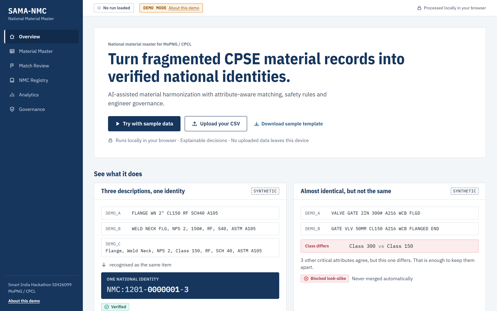
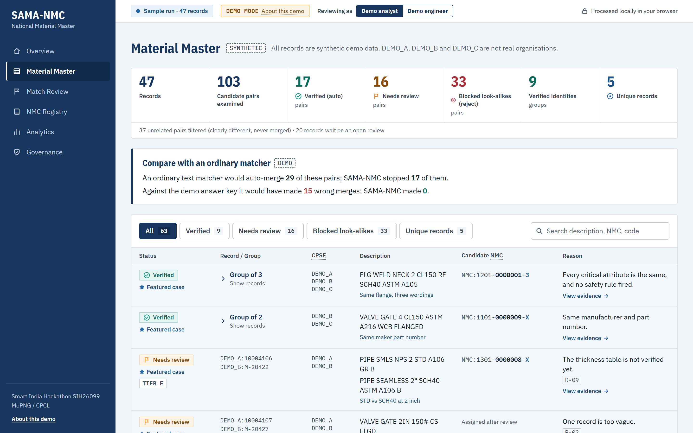
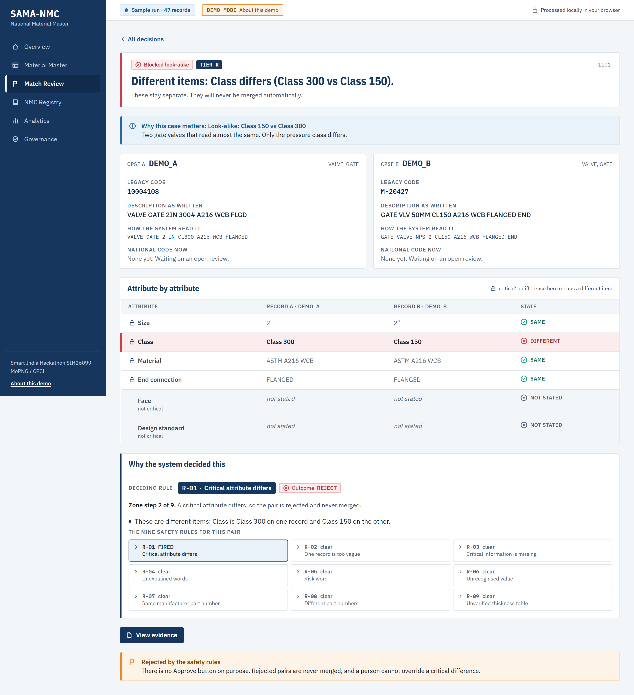
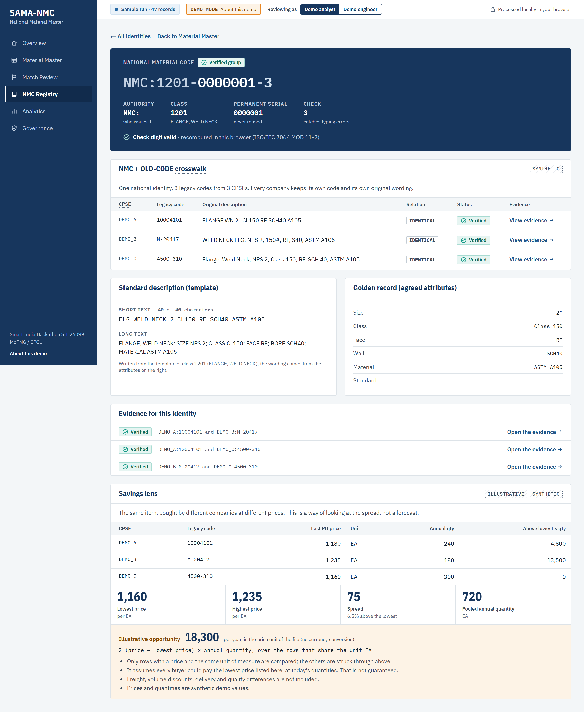

# SAMA-NMC: precision-first National Material Master (SIH26099)

**AI proposes. Rules constrain. Engineers approve. The ledger remembers.**

SAMA-NMC finds the same physical material across CPSE SAP masters, issues one permanent Common National
Material Code (`NMC:CCCC-NNNNNNN-K`) with a crosswalk that **keeps every legacy code**, and attaches an Evidence
Certificate to every decision. Engineered items, vaguer descriptions, risk words and unexplained tokens go to
engineers with the evidence pre-filled; only provably identical standard parts auto-merge.

The design documents (research blueprint, PRD, architecture, spec clarifications) are kept private by the team;
this repository contains the implementation.

## What it looks like

All four screenshots below are from the real app, running the sample data — nothing here is a mockup.

### 1. Open it and try it — no setup, no login



This is the home page. You press one button and the tool runs on example data right there in your browser. The
two cards already show the whole idea in ten seconds: on the left, three companies wrote the same flange three
different ways and the tool recognised them as one item; on the right, two valves look almost the same but their
pressure class is different, so the tool **refuses** to treat them as the same item.

### 2. The results, with honest numbers



After a run, you get a straight count: how many records went in, how many were **verified automatically**, how
many need a person to look at them, and how many were **blocked as look-alikes** (close, but not actually the
same item). It also shows its homework: an ordinary text-matching tool would have wrongly merged 15 of these
pairs; our tool made zero wrong merges on the same data.

### 3. Every decision explains itself



Click into any match and you see exactly why the tool decided what it decided — attribute by attribute (size,
class, material...), in plain words (SAME / DIFFERENT / NOT STATED), with the one rule that made the call. Here,
everything matches except the pressure class, so the match is rejected. There's no "Approve" button for this
one, on purpose: a person is never allowed to override a real conflict.

### 4. One national code, with the paper trail kept



Once a match is confirmed, the three companies' separate old codes are linked to **one new national code**
(`NMC:1201-0000001-3`) — and the old codes are never deleted, so nothing breaks on the company side. As a bonus,
because we now know it's the same item, we can line up what each company paid for it and show the price gap.

## The live demo

A static website where evaluators try the real engine themselves, with no login and no backend:

`Overview -> Try sample data (or upload a SAMA-NMC formatted CSV) -> Run -> results -> open a match -> see the
reason -> inspect the Evidence Certificate -> see the national code and crosswalk -> governance and audit trail`

- The decision engine runs **in the visitor's browser** (a Web Worker). Uploaded files never leave the tab.
- Deploy it to Vercel: import this repository, set **Root Directory** to `frontend`, deploy (no environment variables).
- Everything on screen comes from the engine. Demo data is labelled synthetic; engineering tables are labelled unverified.

## How it fits together

| Part | Where | Role |
|---|---|---|
| Python reference engine | `backend/sama/` | Source of truth for decision semantics (normalize, extract, compare, rules R-01..R-09, nine-step zone, frozen gate, clustering, NMC) |
| Frozen artifacts | `engine_assets/` (mirrored to `frontend/public/engine/`) | config tables, frozen text model, frozen gate scorer + thresholds, loaded identically by both engines |
| Browser engine | `frontend/src/engine/` | TypeScript implementation of the same frozen semantics; parity-tested against Python |
| Web app | `frontend/src/app/` | Next.js static export; design system in `src/components/` |
| Benchmark and research | `bench/` | seeded generator, evaluation, GPU embedding experiments (`bench/gpu/`, see `bench/gpu/requirements-gpu.txt`) |
| Configuration | `config/` | YAML engineering tables (abbreviations, units, size table, hierarchies, risk words, tiers, class templates), all marked unverified/draft |
| CI | `.github/` | GitHub Actions runs every Python, parity and end-to-end test on each push; Dependabot keeps dependencies patched |

**Parity guarantee.** `python -m bench.export_golden` writes fixtures; `npx vitest run` in `frontend/` must
reproduce them exactly (records, pairs, text model, full runs, audit hashes). A mismatch fails the build.
Boundaries are documented in [frontend/src/engine/PARITY.md](frontend/src/engine/PARITY.md).

## Run it locally

```powershell
cd frontend
npm install
npm run dev            # http://localhost:3000
```

```powershell
# from the repo root: Python reference + tests
pip install -r requirements.txt
$env:PYTHONPATH = "backend;."
python -m pytest -q                       # reference tests incl. safety invariants and scenarios A-F
python -m bench.generate --seed 7 --n-materials 3800 --split 40,40,20 --out data/synthetic/demo
python -m bench.generate --seed 7 --n-materials 1200 --out data/synthetic/unseen --unseen
python -m bench.export_assets --data data/synthetic/demo --unseen data/synthetic/unseen   # also re-checks the hard gates
python -m bench.export_golden
```

```powershell
cd frontend
npx vitest run                                  # engine parity + unit tests
npm run build; npx playwright test              # static export + end-to-end tests (drives installed Chrome)
```

## Measured results (synthetic benchmark; Python reference)

Same candidate pairs, test split (17,235 pairs): SAMA-NMC **0** wrong auto-merges (95% upper bound 0.48%) and 619
correct; an ordinary text-similarity matcher at its best-F1 threshold made 890 wrong merges. On a held-out
"unseen wording" set SAMA-NMC still made 0 wrong auto-merges. These are measurements on synthetic data, not
production guarantees; real-labelled evaluation is not yet done. See the Analytics page for the honest limits, including the candidate-recall weakness on new
abbreviations.

## Security

The live demo has no backend and sends no data anywhere; a strict Content-Security-Policy makes the browser enforce
that. Details and how to report an issue: [SECURITY.md](SECURITY.md).

## Honesty

- All benchmark and sample data are **synthetic**. DEMO_A / DEMO_B / DEMO_C are not real organisations.
- Every engineering table in `config/` is `unverified` or `draft` until a domain reviewer signs it off; the demo says so.
- "Measured", never "certified". No unsourced headline numbers.
- Reviewer personas in the demo are roles (Demo analyst, Demo engineer), never invented people.
